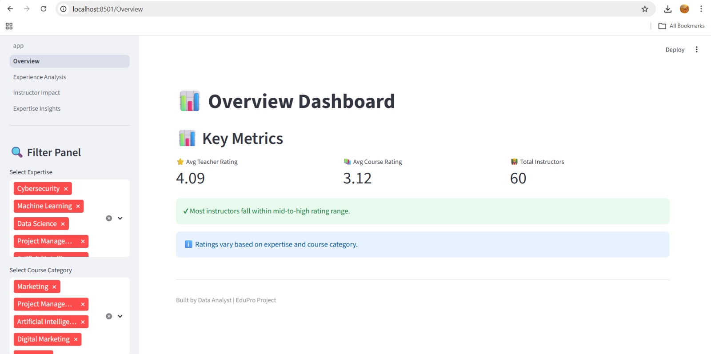
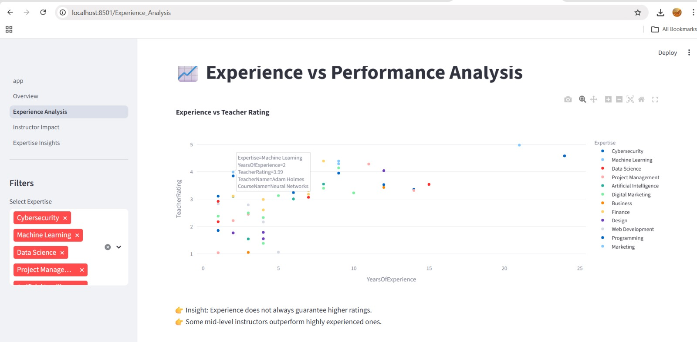
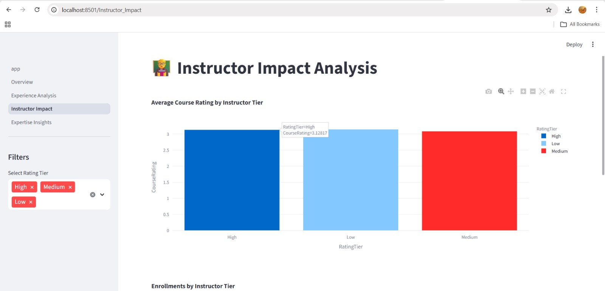
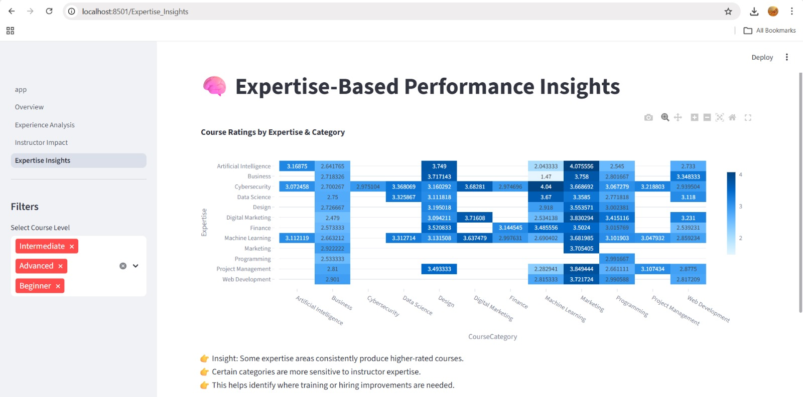

## 🌐 Live Dashboard
https://EduPro-Analytics.streamlit.app
# 📊 EduPro Instructor & Course Quality Analysis

## 🚀 Project Overview

This project analyzes instructor performance and its impact on course quality on the EduPro platform.
The goal is to provide data-driven insights to improve teaching effectiveness and enhance learner experience.

---

## 🎯 Problem Statement

EduPro lacks a structured approach to evaluate:

* Instructor effectiveness
* Course quality consistency
* Impact of experience and expertise

This project addresses these gaps using data analysis and interactive dashboards.

---

## 🛠 Tools & Technologies

* Python
* Streamlit
* Pandas
* Plotly

---

## 📊 Key Features

* Interactive Dashboard (built using Streamlit)
* Experience vs Performance Analysis
* Instructor Impact Analysis
* Expertise-Based Heatmap
* Dynamic Filters for user exploration

---

## 📸 Dashboard Preview

### 🔹 Overview



### 🔹 Experience Analysis



### 🔹 Instructor Impact



### 🔹 Expertise Insights



---

## 🧠 Key Insights

* Instructor experience does not always guarantee higher ratings
* High-rated instructors significantly improve course performance
* Expertise plays a critical role in course quality
* Certain course categories depend heavily on instructor expertise

---

## 📄 Research Paper

A detailed research paper is included in this repository explaining methodology, analysis, and findings.

---

## ▶️ How to Run the Project

```bash
pip install -r requirements.txt
python -m streamlit run app.py
```

---

## 📌 Future Improvements

* Add machine learning models for prediction
* Include student feedback analysis
* Deploy dashboard for public access

---

## 👨‍💻 Author

EduPro Data Analytics Project
Frontend Data Analyst Internship
